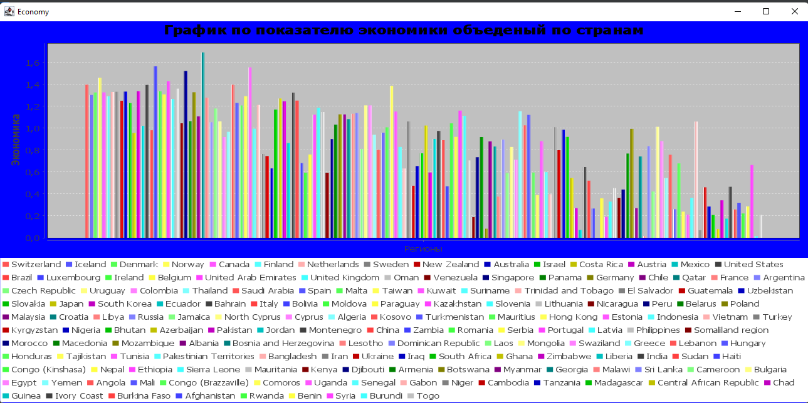

Хлыстов Кирилл Алексеевич Вариант 5

2. Сущности:
    
    Statistic храненит информации распаршеного csv файла после парса

    Rank хранит информацию строки таблицы rank, содержит такие столбцы как название страны, её рейтинг

    Region хранит информацию строки region содержит такие столбцы как название строки, её регион

    Scores хранит информацию строки scores содержит такие столбцы как название страны, разные scores

3. Распарсил CSV фаил и сохранил все данные:
4. Создал файл БД SQLite  
5. Заполнил её таблицами 3NF:

6. Все данные из набора объектов сохранил в таблицы БД
7. Сделал SQL-запросы в БД, для своих задач:
  
8. Полученные данные вывел в текстовом виде в консоль:

9. Числовые данные по заданию 1 визуализировал в виде гистограммы:
